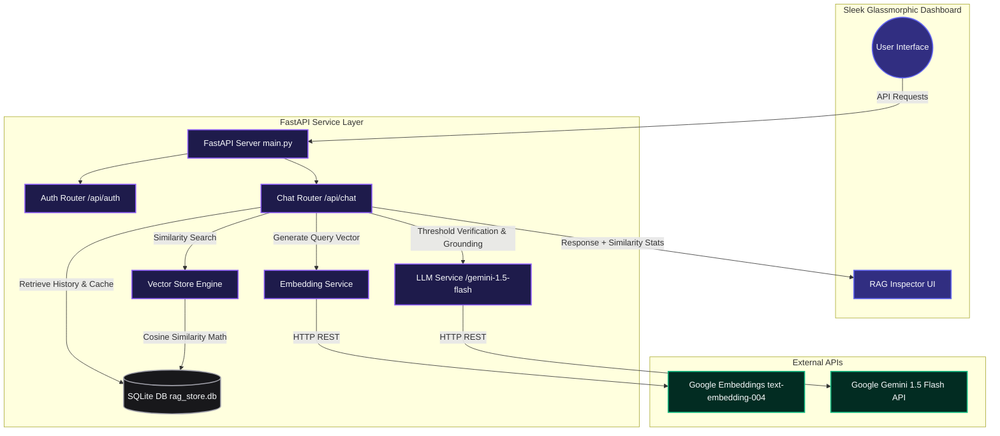

# TRUEAILAB Production-Grade GenAI Assistant with RAG

This repository contains a complete, production-style, high-performance Chat Assistant that answers user questions using **Retrieval-Augmented Generation (RAG)**. 

The application utilizes a **FastAPI backend** in Python alongside a **premium glassmorphic HTML/CSS/JS frontend** incorporating real-time token tracking, JWT authentication, and a visual **RAG Inspector** showing query similarity scores, document links, and latencies.

---

## 🏗️ Technical Architecture Diagram



---

## 🚀 Key Design & Core Workflows

### 1. Document Chunking & Embedding Strategy
To handle arbitrarily long corporate articles, we implement a recursive semantic chunking algorithm:
- **Chunking Pipeline**: Documents inside `docs.json` are parsed on startup. A text-splitting algorithm utilizes overlapping sliding windows (e.g., `chunk_size = 250 words` with `chunk_overlap = 40 words`) to guarantee that context is not lost at artificial borders. At an average of 1.3 tokens/word, this aligns perfectly with the recommended **300–500 tokens** metric.
- **Unified Embedding Wrappers**: Custom endpoints dynamically serialize text chunks into high-density float vectors utilizing Google’s `text-embedding-004` (or OpenAI's `text-embedding-3-small`). 
- **Persisted Caching**: Calculated vectors are serialized to JSON strings and cached securely in local SQLite tables (`documents` and `document_chunks`), completely eliminating redundant external API network costs on subsequent server runs.

### 2. Similarity Search & Grounding Math
Rather than simple keyword matching, we calculate exact semantic similarities using the standard **Cosine Similarity** formula:

$$\text{Cosine Similarity}(A, B) = \frac{A \cdot B}{\|A\| \|B\|} = \frac{\sum_{i=1}^{n} A_i B_i}{\sqrt{\sum_{i=1}^{n} A_i^2} \sqrt{\sum_{i=1}^{n} B_i^2}}$$

- **Dual-Engine Execution**: To ensure 100% execution compatibility on any host OS, the `VectorStore` computes cosine similarities using high-speed, vectorized **NumPy** operations, falling back immediately to pure-Python floating math if compiled C-libraries are absent.
- **Similarity Threshold**: We enforce a configurable grounding threshold (default: `0.65`). Chunks scoring below this threshold are discarded.
- **Bypassed Execution (Zero-Hallucination Safe Fallback)**: If zero retrieved chunks meet the similarity threshold, the server immediately stops, bypasses calling the LLM entirely, and returns the safe fallback:
  > *"I could not find enough information in the knowledge base to answer this question."*
  This saves API token charges, ensures 100% grounded execution, and eliminates hallucinations.

### 3. Unified LLM Integration & Prompt Design
We design a strict, hyper-focused grounded instructions system:
- **Unified Caller**: The backend interfaces directly with Google AI Studio's `gemini-1.5-flash` model using pure REST requests with backoffs and timeouts, capturing exact token totals (`usageMetadata.totalTokenCount`).
- **Prompt Structure**:
  ```text
  Context:
  {retrieved_context} (includes document links & matching scores)
  
  Conversation History:
  {history} (maintains last 3-5 message pairs)
  
  Question:
  {user_question}
  ```
- **Feverish Temperature Control**: Fixed at `0.2` to enforce empirical correctness over creative variance.

### 4. Database Schema (SQLite)
The application leverages a local relational database (`rag_store.db`) to enable:
- `users`: Stores user identity hash maps for secure logins.
- `documents` / `document_chunks`: Stores corporate guidelines, titles, contents, and JSON-serialized vector embeddings.
- `chat_history`: Syncs and stores message lists mapped to specific session IDs and user identities.

---

## 🛠️ Installation & Setup Guide

### Prerequisites
- Python 3.10 or higher
- An active API key from **Google AI Studio** (Gemini) or **OpenAI**

### 1. Clone & Initialize Directory
Ensure your current directory is structured inside your project folder:
```bash
cd C:\Users\User\.gemini\antigravity\scratch\rag-assistant
```

### 2. Configure Environment variables
Duplicate `.env.example` into a working `.env` file:
```bash
cp .env.example .env
```
Open `.env` and configure your API keys:
```env
GEMINI_API_KEY=AIzaSy...YourActualGeminiKey
LLM_PROVIDER=gemini
EMBEDDING_PROVIDER=gemini
```

### 3. Install Dependencies
Run standard package installations:
```bash
pip install -r requirements.txt
```

### 4. Launch the Backend Server
Start the FastAPI server via Uvicorn:
```bash
python -m uvicorn app.main:app --reload --port 8000
```
On startup, the server will read `docs.json`, chunk the documents, fetch their embeddings, and seed your local SQLite database automatically.

You can verify the backend endpoints interactively by visiting:
*   [FastAPI Documentation](http://127.0.0.1:8000/docs)

### 5. Launch the Frontend UI
To avoid any CORS or relative paths complications, launch a simple, instant local webserver in the `frontend` folder:
```bash
cd frontend
python -m http.server 3000
```
Then, point your browser to:
👉 **`http://localhost:3000`**

---

## 🌟 Interactive Inspection Walkthrough
When testing the application, follow these guidelines to experience the full production-grade details:
1.  **Semantic Queries**: Ask: *"How do I reset my password?"*
    *   The frontend will show a typing loader.
    *   The RAG Inspector panel on the right will update immediately, showing a similarity score of **~0.80+** for the *"TRUEAILAB Password and Security Policy"* document, listing the exact matching chunk.
    *   The chatbot will answer correctly based **only** on the context.
2.  **Out-Of-Domain Grounding Tests**: Ask: *"What is the capital of France?"* or *"Who won the 2022 World Cup?"*
    *   The vector database calculates scores.
    *   All chunks score very low (**< 0.40**).
    *   The RAG Inspector displays: `GROUNDING FALLBACK TRIGGERED`.
    *   The chatbot serves the safe fallback response: *"I could not find enough information in the knowledge base to answer this question."*
3.  **Authentication Features**:
    *   Register a username and password in the left sidebar card.
    *   Log out and start a new session. Notice that historical logs stay secure and reload dynamically upon logging back in.
